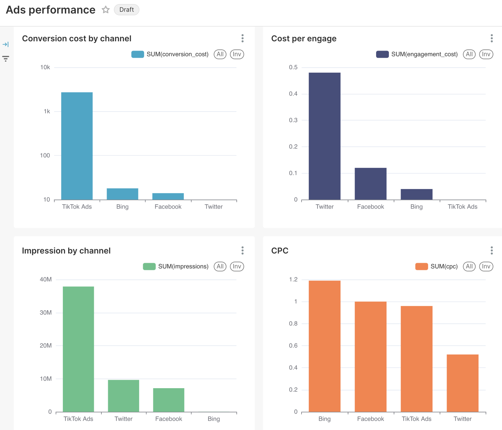

## Как запустить проект
0. Клонируйте этот репозиторий и зайдите в терминале в директорию клонированной папки
1. Убедитесь, что у вас установлены docker и docker compose (если не установлен, то установите сами)
```
docker --version
docker-compose --version
```
2. Убедитесь, что вы в директории `bdst_coursework_dbt`
```
pwd
```
3. Создайте образ dbt
```
docker build -t dbt-postgres .
```
4. Проверьте, что имадж сбилдился
```
docker images
```
5. Запустите композ 
```
docker compose up -d
```
6. Теперь надо запустить dbt скрипты (пишите это в терминале)
```
docker compose exec dbt dbt seed
docker compose exec dbt dbt build
```
7. Дальше надо подключиться к постгресу в localhost:5432 с логином db_user и паролем db_password
8. Внутри базы shared_db создать схему для суперсета
```
CREATE SCHEMA IF NOT EXISTS superset_schema;
```
9. Дальше возвращаемся в терминал и пишем
```
docker compose exec superset superset db upgrade
docker compose exec superset superset fab create-admin --username admin --firstname Admin --lastname User --email admin@example.com --password admin
docker compose exec superset superset init
```
10. После этого зайти по localhost:8088, далее "Data" справа сверху -> connect data source -> PostgreSQL -> postgresql://db_user:db_password@db:5432/shared_db?options=-csearch_path%3Ddbt_schema -> создать графики (выбирать датасетом таблицу ads_basic_performance) и вставить их в дашборд как на картинке


Все,  готово, вы великолепны!

## Что в файлах
1. bdst_dbt - папка для dbt, там лежат исходники seeds, модели models (staging, core и mart), конфиг файлы, logs с логами и т.д.
2. Dockerfile с конфигом dbt
3. docker-compose.yaml, который надо запускать
4. superset_config.py настройки для суперсета